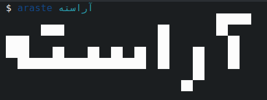

<div align="center">
  <h1> آراسته </h1>
  <h2> تبدیل نوشته‌های فارسی به هنر اسکی </h2>



</div>


مشابه ابزار figlet ولی برای نوشته‌های فارسی و عربی

**توجه** : ابزار آراسته تحت توسعه است.

در حال حاضر می‌توانید با دستور زیر، با استفاده از قلمی که تنظیم شده است یک واژه، جمله یا چند سطر نوشته را بنویسید.  

```bash
$ araste 'آراسته'
```

خروجی برنامه با فونت از پیش فرض تعیین شده :
```
                                      ██████
        ████                ██        ██
  ████                      ██          ██
  ████    ██    ██  ██  ██  ██    ██    ██
    ██████████████████████  ██    ██    ██
                                  ██
                                ██
```
## نصب و استفاده

1. برای نصب برنامه تنها اجرای این دستور نیاز است.

````bash
bash <(curl -s https://raw.githubusercontent.com/ekm507/araste/main/installer/install.sh)
````
یا در شل هایی مانند fish :
````bash
curl -s https://raw.githubusercontent.com/ekm507/araste/main/installer/install.sh | bash
````


2. از برنامهٔ آراسته استفاده کنید! برای استفاده نیاز به پایتون نسخهٔ ۳ دارید. این برنامه وابستگی به بستهٔ خاصی ندارد و با بسته های پیش‌فرض پایتون کار می‌کند.


## برای انجام

- [x] طراحی یک قلم فارسی اسکی
- [x] پشتیبانی از قالب flf مشابه figlet
- [x] طراحی یک قلم دیگر
- [ ] داشتن ۳ قلم
- [x] تبدیل قلم‌ها به فرمت flf  
مشابه راهنمای [این صفحه](https://github.com/Marak/asciimo/issues/3)
- [ ] رفع اشکال‌های قلم flf  
- [ ] کامل کردن برنامهٔ آراسته تا بتواند به‌درستی کار کند. 
- [ ] توسعهٔ یک ابزار خط‌فرمان با امکان نصب
- [ ] انتشار نسخهٔ ۱
- [ ] نوشتن یک README انگلیسی
- [ ] افزودن امکان انتخاب قلم و فهرست‌کردن قلم‌های موجود به نرم‌افزار آراسته                             
